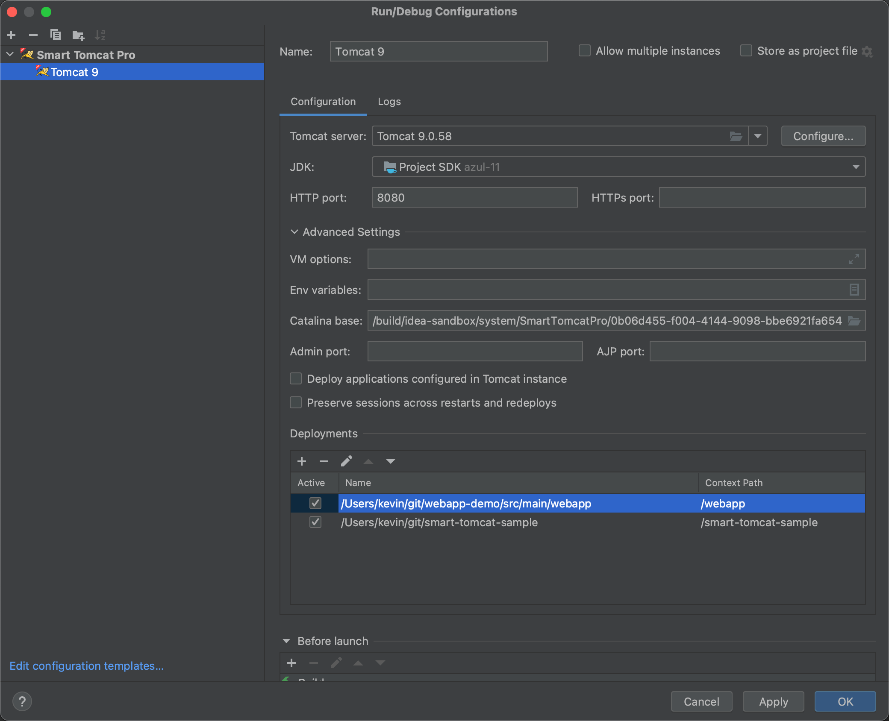

# Smart Tomcat Pro

Smart Tomcat Pro is a plugin for IntelliJ IDEA Community and Ultimate that provides a better experience for Tomcat users.

It enables developers to run and debug applications on Tomcat server. It is a must-have plugin for developers who are working with the Tomcat server and IntelliJ IDEA CE.

This plugin supports Tomcat 7 and later versions.

  

## Features

- Run/Debug Configurations for Tomcat
- Support multiple deployments for a single Tomcat instance
- Support deployment from IntelliJ Artifacts, Directory, Exploded, and WAR file
- Support HTTPS, AJP, Admin port, and more configurations
- Integration with Gradle and Maven projects
- View Tomcat logs directly within IntelliJ IDEA
- Support specifying the JDK for Tomcat
- Tomcat Server Manager
- Support multiple Tomcat instances

## Installation

- Using the IDE built-in plugin system:
  
  <kbd>Settings/Preferences</kbd> > <kbd>Plugins</kbd> > <kbd>Marketplace</kbd> > <kbd>Search for "SmartTomcatPro"</kbd> >
  <kbd>Install</kbd>

## Usage

1. Open your project in IntelliJ IDEA.
2. Go to <kbd>Run</kbd> > <kbd>Edit Configurations</kbd> > <kbd>+</kbd> > <kbd>Smart Tomcat Pro</kbd>.
3. Add the Tomcat server and configure the deployment.
4. Click <kbd>Run</kbd> or <kbd>Debug</kbd> to start the server.

## Credits

This plugin is developed and maintained by [Kevin Yue](https://github.com/yuezk), the maintainer of the free version [Smart Tomcat](https://plugins.jetbrains.com/plugin/9492-smart-tomcat).

## License

See the [EULA](./EULA) for license information.
